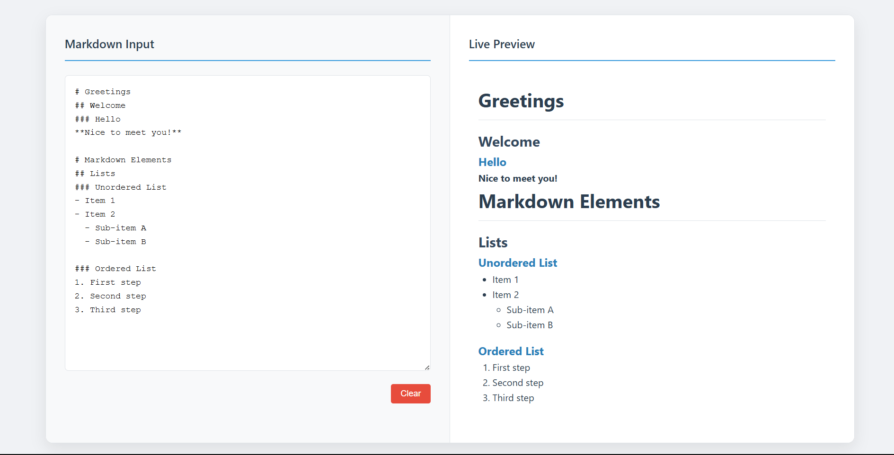

# Markdown Previewer - A Modern Markdown Editing Application

A responsive and interactive web application for writing and previewing Markdown in real time. Built with vanilla JavaScript and modern CSS, this application provides a seamless experience for content creators and developers.

## 📱 Application Interface



## 🌐 Live Demo
[View Live Application](https://markdown-previewer.vercel.app/)

## 🚀 Features

### Core Features
- **Responsive Design**: Works seamlessly on desktop, tablet, and mobile devices.
- **Real-Time Markdown Preview**: Instantly renders Markdown as you type.
- **GitHub Flavored Markdown (GFM)**: Supports tables, code blocks, and more.
- **Line Breaks Support**: Press `Enter` to create new lines in the preview.
- **Clear Button**: Reset the input and preview instantly.

### User Experience
- Smooth animations and transitions.
- Intuitive and minimalistic interface.
- Error handling for invalid Markdown syntax.
- Hover effects and visual feedback.

## 🛠️ Technologies Used
- **HTML5**
- **CSS3 (with Flexbox and Grid)**
- **Vanilla JavaScript**
- **[Marked.js](https://marked.js.org/)** for Markdown parsing

## 📂 Project Structure
```
📁 Markdown-Previewer
│-- 📄 index.html      # Main HTML file
│-- 📄 style.css       # Styling file
│-- 📄 script.js       # JavaScript logic
│-- 📄 README.md       # Project documentation
```

## 🔧 Setup & Usage

### Prerequisites
- A modern web browser.
- Basic understanding of HTML, CSS, and JavaScript.

### Installation
1. **Clone the repository**:
   ```sh
   git clone https://github.com/your-username/markdown-previewer.git
   ```
2. **Navigate to the project directory**:
   ```sh
   cd markdown-previewer
   ```
3. **Open `index.html` in a browser** (No setup required).

---
Made with ❤️ using JavaScript & Marked.js 🚀
